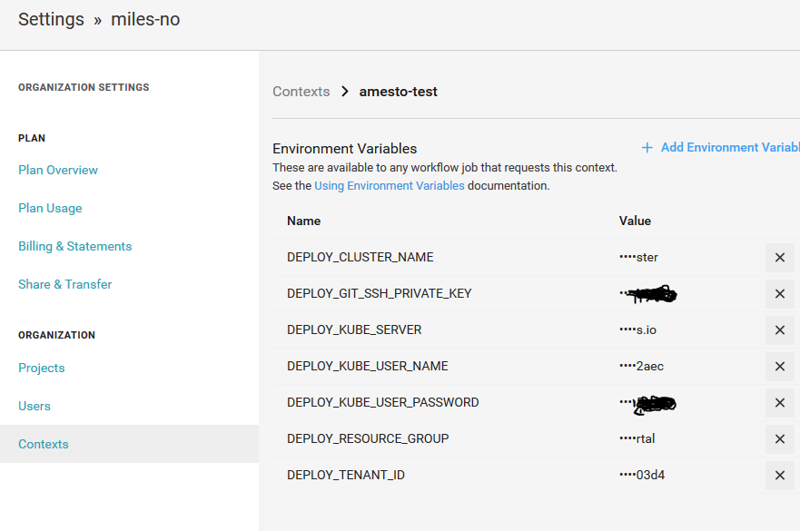
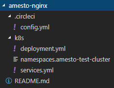

Azure AKS Cluster Deployment Image
=======================================
The [CircleCi](http://circleci.com/) image responsible for handling deployments to clusters running in Azure AKS

## Description

This image is used to deploy our pods to AKS with circleci. The image will clone the repo, login with az aks and run `kubectl apply -f` on the following files in `/k8s/`
- `secrets.clustername.yml` (replace with your own cluster name)
- `configmaps.clustername.yml` (replace with your own cluster name)
- `backups.clustername.yml` (replace with your own cluster name)
- `deployment.yml`
- `statefulsets.yml`
- `replicasets.yml`
- `services.yml`
- `daemonsets.yml`
- `jobs.yml`

in the namespaces defined in `namespaces.clustername` (replace with your own cluster name). 

### Folder structure
```
project root
│   project files
│   ...
└───k8s
│   │   namespaces.clustername
│   │   secrets.clustername.yml
│   │   configmaps.clustername.yml
│   │   backups.clustername.yml
│   │   deployment.yml
│   │   statefulsets.yml
│   │   replicasets.yml
│   │   services.yml
│   │   daemonsets.yml
│   │   jobs.yml
```

### Usage

```
$KUBE_SERVER='kube api server uri'
$CLUSTER_NAME='cluster name' 
$KUBE_USER_NAME='kube cluster user'
$KUBE_USER_PASSWORD='kube cluster user password'
$GIT_SSH_PRIVATE_KEY="base64 encoded private key"
$GIT_REPO='git@github.com:miles-no/my-repo.git'
$GIT_REPO_NAME='my-repo'
$GIT_BRANCH='master'
$DOCKER_TAG=1 #If tagging images with circle build number. Not used in this example
$TENANT_ID='tennant id' 
$RESOURCE_GROUP='resource group'
$DEBUG=1 #optional

docker run -e KUBE_SERVER=$KUBE_SERVER -e KUBE_USER_NAME=$KUBE_USER_NAME -e KUBE_USER_PASSWORD=$KUBE_USER_PASSWORD -e GIT_SSH_PRIVATE_KEY=$GIT_SSH_PRIVATE_KEY -e GIT_REPO=$GIT_REPO -e GIT_REPO_NAME=$GIT_REPO_NAME -e GIT_BRANCH=$GIT_BRANCH -e DOCKER_TAG=$DOCKER_TAG -e TENANT_ID=$TENANT_ID -e CLUSTER_NAME=$CLUSTER_NAME -e RESOURCE_GROUP=$RESOURCE_GROUP -e DEBUG=$DEBUG milesdrift/aks-deploy
```

### Example circleci setup

Here is a simple `circle.yml` example
```
version: 2
jobs:
  deploy:
    docker:
      - image: milesdrift/aks-deploy:latest
    steps:
      - run:
          name: Execute
          command: |
            export KUBE_SERVER=$DEPLOY_KUBE_SERVER
            export CLUSTER_NAME=$DEPLOY_CLUSTER_NAME
            export KUBE_USER_NAME=$DEPLOY_KUBE_USER_NAME
            export KUBE_USER_PASSWORD=$DEPLOY_KUBE_USER_PASSWORD
            export GIT_SSH_PRIVATE_KEY=$DEPLOY_GIT_SSH_PRIVATE_KEY
            export GIT_REPO=git@github.com:miles-no/${CIRCLE_PROJECT_REPONAME}.git
            export GIT_REPO_NAME=$CIRCLE_PROJECT_REPONAME
            export GIT_BRANCH=$CIRCLE_BRANCH
            export DOCKER_TAG=$CIRCLE_BUILD_NUM
            export TENANT_ID=$DEPLOY_TENANT_ID
            export RESOURCE_GROUP=$DEPLOY_RESOURCE_GROUP
            /run.sh
workflows:
  version: 2
  amesto_nginx:
    jobs:
      - deploy:
          context: amesto-test
```
Using the `amesto-test` context in circleci.



To deploy `amesto-nginx`



in the `amesto-test-cluster`

#### Building and pushing the docker Image
```
docker login -u milesdrift -p xyz
docker build -t milesdrift/aks-deploy:latest .
docker push milesdrift/aks-deploy
```
